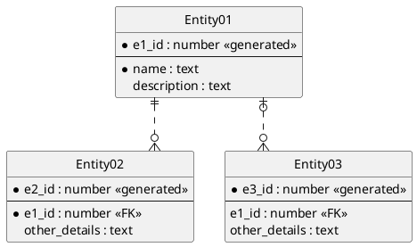

UML 图可以绘制时序图，在本地生活实习的时候，经常看到时序图用于描述用户在点击页面链接到看到页面内容之间的全链路过程。时序图清晰地表示了链路中的每一个环节，最重要的是，顾名思义，环节发生的顺序。

UML 图还可以绘制静态结构图，是本次学习的重点。我应该会用来绘制业务结构图和数据库图。绘制工具为PlantUML。
<!--more-->

### PlantUML
<hr/>

#### 环境搭建

PlantUML-server

1. 安装 docker
2. 按照[链接](https://github.com/plantuml/plantuml-server#how-to-run-the-server-with-docker)使用docker运行 plantUML 服务器

PlantUML+VSCode

1. 安装 PlantUML 插件
2. 根据文档在 `setting.json` 里添加服务器的配置，即可实现使用服务器渲染 UML 图

```json
{
  "plantuml.server": "http://127.0.0.1:8080",
  "plantuml.render": "PlantUMLServer"
}
```

#### E-R 图

`|` 代表 1
`}` 代表 多
`o` 代表 0（可能为0）

组合使用，可以生成，0或1，1，0或多，1或多

详细语法参考下面[例子](https://plantuml.com/en/ie-diagram)




### Reference
<hr/>

- [ ] 《大话设计模式》程杰
- [ ] [学习一之UML类图](https://www.shuzhiduo.com/A/WpdKxLvmzV/)
- [x] [UML 图表和数据库建模的简单指南](hhttps://www.microsoft.com/zh-cn/microsoft-365/business-insights-ideas/resources/guide-to-uml-diagramming-and-database-modeling)
- [x] [创建 UML 静态结构图](https://support.microsoft.com/zh-cn/office/%e5%88%9b%e5%bb%ba-uml-%e9%9d%99%e6%80%81%e7%bb%93%e6%9e%84%e5%9b%be-bb11b3df-8830-4e31-a437-332585da7ce8?ui=zh-cn&rs=zh-cn&ad=cn)
- [x] [类图](https://plantuml.com/zh/class-diagram)
- [x] [PlantUML-server](https://github.com/plantuml/plantuml-server)
- [x] [Entity Relationship Diagram](https://plantuml.com/en/ie-diagram#06a40b5d1c1792ac)